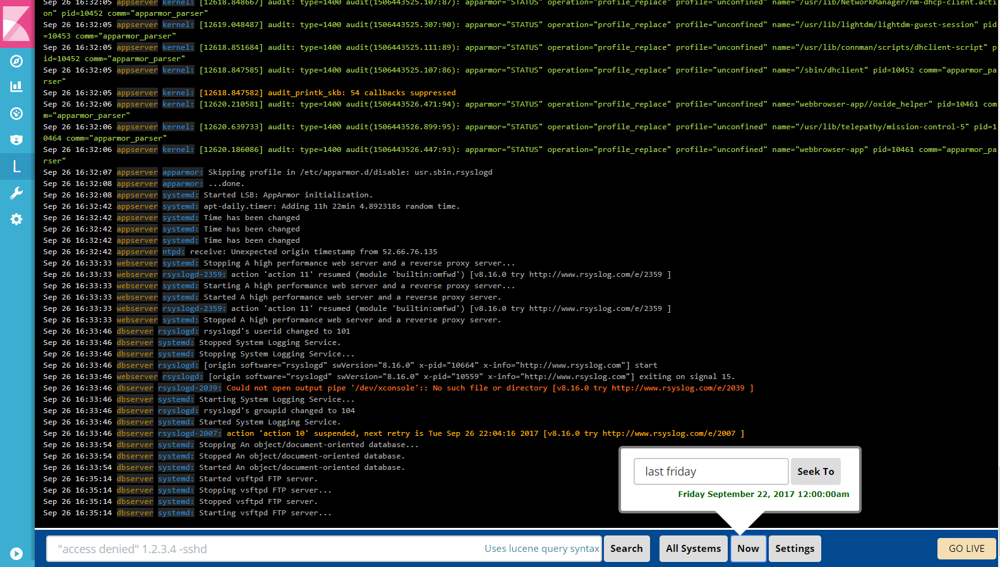

# LogTrail - Log Viewer plugin for Kibana

[](https://github.com/sivasamyk/logtrail/releases) [](https://www.elastic.co/downloads/past-releases/kibana-6.5.3)
[](https://github.com/sivasamyk/logtrail) [](https://paypal.me/sivasamyk)

LogTrail is a plugin for Kibana to view, analyze, search and tail log events from multiple hosts in realtime with devops friendly interface inspired by [Papertrail](https://papertrailapp.com/).



Features
--------
 - View, analyze and search log events from a centralized interface
 - Clean & simple devops friendly interface
 - Live tail
 - Filter aggregated logs by hosts and program
 - Quickly seek to logs based on time
 - Supports highlighting of search matches
 - Supports multiple Elasticsearch index patterns each with different schemas
 - Can be extended by adding additional fields to log event
 - Color coding of messages based on field values

Installation
------------
- Prerequisites
  - Download and install Elasticsearch and Kibana
  - Logtrail is supported and tested with Kibana 6.x and 5.x
- Install logtrail plugin (requires restart of Kibana after install)
  - Kibana 6.5.3 : `./bin/kibana-plugin install https://github.com/sivasamyk/logtrail/releases/download/v0.1.30/logtrail-6.5.3-0.1.30.zip`
  - Kibana 5.6.5 : `./bin/kibana-plugin install https://github.com/sivasamyk/logtrail/releases/download/v0.1.23/logtrail-5.6.5.3.1.23.zip`
  - Other versions : [https://github.com/sivasamyk/logtrail/releases](https://github.com/sivasamyk/logtrail/releases)
- Kibana requires exact match of plugin version to the Kibana version. If you can't find logtrail plugin release for a Kibana release, follow the instrcutions [here](docs/how_to.md#2-update-kibanaversion-in-logtrail-plugin-archive) to update Kibana version in your logtrail plugin archive.
- Refer [Logtrail Config Examples Repo](https://github.com/sivasamyk/logtrail-config-examples) for sample configurations for syslog, Java app, Kubernetes logs.

Configuration
-------------
- Logtrail can be configured by editing following fields present in `logtrail.json` file located inside`./plugins/logtrail` directory.
- `default_index` - Elasticsearch index where the syslog events are stored (default: logstash-*)
- `default_time_range_in_days` - Default time range in days to search when time is not specified using Seek button.
    Example: Value of 30 means logtrail will search only in logs from last 30 days, unless time is specified using Seek button.
    Value of 0 means logtrail will search in all available logs by default.
- `display_timezone` - Timezone to display the timestamp in Event Viewer. e.g. `America/Los_Angeles`. Default value of `local` will use the timezone of browser. The time specified in `Seek To` popup will always use browser timezone.
- `display_timestamp_format` - Format to display the timestamp in Event Viewer. For list of valid value refer [here](http://momentjs.com/docs/#/displaying/)
- `default_search` - if specified, this will applied as default search text while launching logtrail. The value can be any search text. e.g. `ssh` - shows all logs with `ssh` in message field. or `log_level:SEVERE` - shows all logs where `log_level` field is `SEVERE`. The field name should be a valid field in elasticsearch document. The default search field is the field mapped to `message`.
- `fields` - Edit this parameter to map the event fields in ES to logtrail fields
    - `timestamp` - maps to @timestamp field inserted by logstash. This will be used for querying internally. Logtrail recommends @timestamp to be stored in UTC in ES.
    - `hostname` - hostname from where the events were received. Also used by hostname filter. Hostname field should be of type keyword. For more info checkout [Hostname field need to be of type keyword](docs/how_to.md#1-hostname-field-need-to-be-of-type-keyword)
    - `program` - program that generated this event.
    - `message` - actual event message. This field will be used by search.
- Example:  If the event fields names are @timestamp, host, process, message the mapping should be
```json
"mapping" : {
        "timestamp" : "@timestamp",
        "hostname" : "host",
        "program": "process",
        "message": "message"
    }
```
- By default each line displayed in the events view is of format:
  `display_timestamp hostname program:message`
- `message_format` - Used to add additional fields to be shown for log event. For more details refer [Adding additional fields](docs/add_fields.md)
- `keyword_suffix` - Specifies the keyword suffix to be appended for hostname & program fields. Set it to `""` to not append any suffix. If not specified (`undefined`) logtrail will append `keyword`.
- `color_mapping` - Color code messages based on field values. For more details refer [Color coding messages](docs/color_mapping.md)
- Any changes in `logtrail.json` requires restart of Kibana
- Logtrail can read `logtrail.json` configuration from Elasticsearch instead of filesystem. This will be useful when sharing same configuration across multiple installations. For more info refer [Load Logtrail configuration from Elasticsearch](https://github.com/sivasamyk/logtrail/blob/master/docs/how_to.md#3-load-logtrail-configuration-from-elasticsearch)
- Refer [logtrail-config-examples](https://github.com/sivasamyk/logtrail-config-examples) repo for sample configurations 
- Logs & Events from Windows, Java, Python, PHP, Perl, Ruby, Android, Docker, .Net can be shipped using syslog protocol.
  - For more configuration options refer to [Papertrail Configuration Help](http://help.papertrailapp.com/).
- Beats/Fluentd can also be used to ship events to ES and fields can be mapped using `fields` parameter in `logtrail.json`
